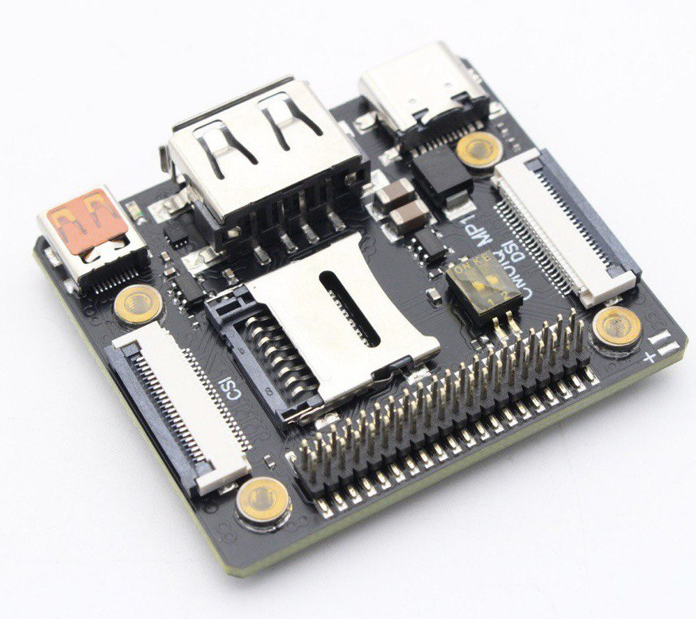
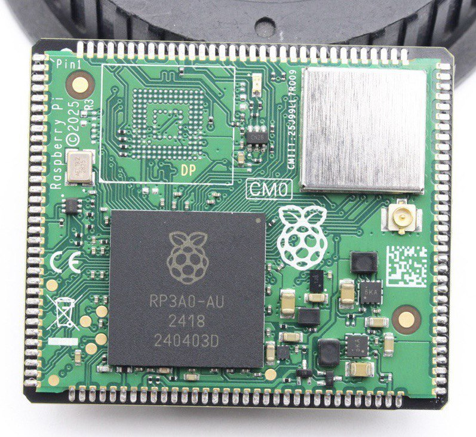

# Raspberry Pi CM0IQ
Tiniest Raspberry Pi board, measuring just 42x36mm! CM0IQ board is based on Raspberry Pi/EDATEC CM0 Compute module

# Features
- Raspberry Pi CM0 Lite
  - 1GHz quad-core 64-bit Arm Cortex-A53 processor
  - 512MB SDRAM
  - H.264/MPEG-4 video decoding, 1080p@30fps
  - H.264 encoding, 1080p@30fps
  - WiFi with extermal antenna connector
- USB type-C for power and gadget mode
- USB-A
- HDMI type D (micro HDMI)
- DSI 4-lane
- CSI 4-lane
- 40-pin GPIO connector, 1.27mm pitch
- SD-card holder
- 5V solder pads
- M2 x4 standoffs for mounting the board

# CM0IQ vs RPi Zero 2W

| Feature        | CM0IQ                     | RPi Zero 2W                  |
| -------------- | ------------------------- | ---------------------------- |
| Dimentions     | 42x36mm, 15.1cm2 | 65x30mm, 19.5cm2 |
| Camera         | CSI 4 lanes               | CSI 2 lanes                  |
| Display        | DSI 4 lanes               | None                         |
| HDMI           | Micro-HDMI                | Mini-HDMI                    |
| USB host       | USB-A connector           | Micro-USB (adapter required) |
| GPIO connector | 40-pin 1.27mm pitch       | 40-pin 2.54mm pitch          |
| Antenna        | IPEX-1  antenna connector | Integrated PCB antenna       |
